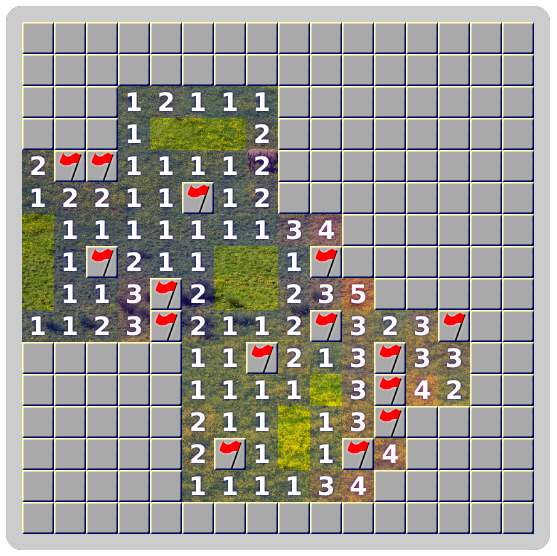

# Functional Minesweeper

[Live Demo!](https://rangerdane.github.io/mines/)

## Features

### Semi-deterministic game state
The game is an (almost) pure reducer: it takes a previousState and an action, and returns a new state.

The single source of impurity within the game logic is in mine shuffling. To purify this, I'd need to bring in a PRNG such as the Mersenne twister, and either use the first click as a seed value (bad), or pass a seed value in from game view. For now, `Math.random()` does just fine.

Building the entire game as a single function allowed me to add time travel for really cheap (a la redux) - so I added an undo button!

### Support for ludicrous board sizes.
There's a noticeable slowdown at about 10,000 tiles, so I've capped the size at 100x100. Testing revealed DOM changes to be the slowest part of updating the view - so I cache the visible board state and compare each turn, to keep DOM changes to a minimum.

### New look, classic feel
Revealing a tile with 0 neighboring mines will open all adjacent squares via breadth-first search.
You'll never lose on the first click - mines aren't seeded until the very first square is revealed. A 3x3 square around the first move is cleared away to maximize the chances of a cascade.

### No packages
The game is written in ES2015 with no external modules or libraries.
